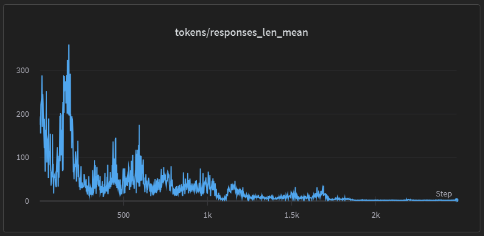

# 基于 LoRA 的 RLHF


众所周知，整个 RLHF (基于人类反馈的强化学习) 分为这么三步：
- SFT (Supervised Fine-Tuning): 有监督的微调，使用正常的 instruction following 或者对话的样本，来训练模型的基础对话、听从 prompt 的能力；
- RM (Reward Modeling): 基于人类的偏好和标注，来训练一个能模拟人偏好的打分模型；
- RL (Reinforcement Learning): 在前面的 SFT 模型的基础上，借助 RM 提供反馈，来不断通过 PPO 的强化学习框架来调整模型的行为。


为了节省训练资源，快速了解整个 RLHF 的过程，我们这里每一步的训练，都采用 LoRA 微调的方式：使用 LoRA 进行 SFT，使用 LoRA 训练 Reward Model，以及使用 LoRA 来进行强化学习 PPO 过程。

下面使用 baichuan-7B 作为基座模型，来实现整个 RLHF 过程。为什么选择 baichuan-7B 呢（而不是 ChatGLM 等模型呢）？因为 baichuan-7B 是一个纯纯的基座模型，本身没有对话能力，因此很适合检验我们训练的效果到底好不好；另一方面，这是一个很强大的基座模型，尤其在中文上，因此“调教”的潜力很大，相比 BLOOM 等模型可能更能训练出效果。

> 注：我这里的训练，并不是为了得到一个综合性能多么好的 Chat 模型（这些事儿留给专业机构团队来做），而是走通整个 RLHF 的过程，了解其中可能的技术难点，感受强化学习和有监督学习的区别，从而获得大模型“调教”的一手经验。

首先，我要感谢 Huggingface 团队开源的 Stack-LLaMA（https://huggingface.co/blog/stackllama）以及相关教程，我这里整个步骤，都是参考这个教程进行的，然后针对 baichuan 做了定制化的适配，并全部改成基于 LoRA 来训练。

好，不废话了，咱们开始吧！

## 1. SFT：训练一个拥有基础对话能力的模型

这里，请大家直接回顾一下 [使用 HC3 数据集让 baichuan 具备对话能力](../projects/ChatBaichuan-HC3/) 这个教程，因为我这里会直接复用这里的所有训练过程和最终的模型。

这里的 SFT 数据，我使用的是 HC3(Human-ChatGPT Comparison Corpus) 数据集：
- HC3 项目：https://github.com/Hello-SimpleAI/chatgpt-comparison-detection

基于 LoRA 训练之后的大概效果是这样的：

- **输入**: "你是谁开发的啊"
- **原始 baichuan-7B**: "我就是你，我是你自己。(自性)"
- **ChatBaichun-HC3**: "我是一个计算机程序，由一个人或一群人编写。我的目的是帮助人们解决问题和回答问题。"

**理清关系**：
- 我们称 baichuan-7B 为 `base-model` ；
- 训练时，我们需要加载一个 language model head，即成为 `base-model-ForCausalLM` ；
- 经过 SFT 的训练之后，我们得到对应的 LoRA 模型记为 `sft-lora-adapter` ；
- 当我们要使用 SFT 的模型时，就是把 `sft-lora-adapter` 加载到 `base-model-ForCausalLM` 上，加载之后，我们记为 `sft-model`。

## 2. RM：训练一个奖励模型
奖励模型，就是一个打分模型，能够**判断模型对于同一个 prompt 的不同输出，哪个更好，哪个更差**。

具体地，我们需要一批人类标注的对不同回答的排序数据，然后基于这样的排序，构造得分，或者更简单一点——构造标签，然后训练一个 regression 模型来打分。

中文的开源高质量排序数据几乎没有，而我又没法请一批人来真正打标一批数据，所以我决定直接使用一个现成的英文 reward 数据集，然后利用 ChatGPT 都翻译成中文，来将就用一用：
- 原始英文 reward 数据集：https://huggingface.co/datasets/yitingxie/rlhf-reward-datasets
- 翻译成中文的 reward 数据集：https://huggingface.co/datasets/beyond/rlhf-reward-single-round-trans_chinese


这个数据集中，每个prompt都对应一个"chosen"字段和一个"rejected"字段，分别代表一个更好的回答和一个更差的回答。

**大致思路**：

要训练打分模型，我们可以直接使用 sigmoid 二分类的方式，给 `base-model` 添加一个 **num_labels=1** 的 **classification head**，即 `base-model-ForSequenceClassification`。这相当于添加了一个 output-dim=1 的 linear 层，模型的输出就一个一维的 logits，这个 logits 经过 sigmoid 函数标准化之后就可以作为分数了。模型的输入实际上是 `prompt+answer`。


然后，我们的 chosen 回答和 rejected 回答都是成对输入的，我们希望前者得到的分数比后者的分数更高，二者的差别越大越好。因此，我们可以设计一个特殊的损失函数：
```python
def compute_loss(self, model, inputs, return_outputs=False):
    rewards_j = model(input_ids=inputs["input_ids_j"], attention_mask=inputs["attention_mask_j"])[0]
    rewards_k = model(input_ids=inputs["input_ids_k"], attention_mask=inputs["attention_mask_k"])[0]
    loss = -nn.functional.logsigmoid(rewards_j - rewards_k).mean()
    if return_outputs:
        return loss, {"rewards_j": rewards_j, "rewards_k": rewards_k}
    return loss
```
其中 j 代表的是包含 chosen 回答的输入，k 代表的是包含 rejected 回答的输入，模型分别对二者计算，得到各自的 logits，二者的差值，经过logsigmoid处理，得到损失函数。用这个损失，来对模型进行优化。


当然，由于我们设计了特殊的双输入输出结构，我们还需要做一些其他的修改，比如自定义 compute_metrics 函数来监控训练过程中的准确率，设计特殊的 data collator 来满足这种数据格式，这些内容都在 `reward_modeling.py` 中实现并进行了详细地注释。

下面，我们可以使用这样的命令，来训练 reward model：
```
# train_rm.sh
CUDA_VISIBLE_DEVICES=0,1,2,3 python reward_modeling.py \
    --model_name baichuan-inc/baichuan-7B \
    --lora_target_models W_pack \
    --num_train_epochs 2 \
    --eval_steps 200 \
    --save_steps 50 \
    --per_device_train_batch_size 10 \
    --per_device_eval_batch_size 16 \
    --train_subset -1 \
    --eval_subset -1 \
    --max_length 1000
```
下面是训练过程中的 wandb 记录：
```
100%|███████████████████████████████████████████████████████████| 3972/3972 [7:06:28<00:00,  6.44s/it]

wandb: 
wandb: Run history:
wandb:                  eval/accuracy ▁▄▅▆▆▆▆▇▇▇▇▇▇▇▇▇▇███████████████████████
wandb:                      eval/loss █▆▅▄▄▃▃▃▃▂▂▂▂▂▂▂▂▂▁▁▁▁▁▁▁▁▁▁▁▁▁▁▁▁▁▁▁▁▁▁
wandb:                    train/epoch ▁▁▁▂▂▂▂▂▂▃▃▃▃▃▄▄▄▄▄▄▅▅▅▅▅▅▆▆▆▆▆▇▇▇▇▇▇███
wandb:              train/global_step ▁▁▁▂▂▂▂▂▂▃▃▃▃▃▃▄▄▄▄▄▅▅▅▅▅▅▆▆▆▆▆▇▇▇▇▇▇███
wandb:            train/learning_rate ███▇▇▇▇▇▇▆▆▆▆▆▆▅▅▅▅▅▄▄▄▄▄▄▃▃▃▃▃▂▂▂▂▂▂▁▁▁
wandb:                     train/loss █▇▆▃▅▇▃▅▅▆▆▄▅▆▃▅▃▂▄▂▂▃▄▃▃▅▁▂▄▅▃▅▆▅▃▄▄▅▃▄

wandb: Run summary:
wandb:                  eval/accuracy 0.71892
wandb:                      eval/loss 0.54986
wandb:                   eval/runtime 281.5312
wandb:        eval/samples_per_second 17.742
wandb:          eval/steps_per_second 1.112
wandb:                    train/epoch 2.0
wandb:              train/global_step 3972
wandb:            train/learning_rate 0.0
wandb:                     train/loss 0.5684
wandb:               train/total_flos 0.0
wandb:               train/train_loss 0.56024
```
可见最终我们的 reward model 在验证集上的准确率达到了 71%，属于一个还不错的结果了。

**理清关系**：
- 依然使用 baichuan-7B 作为 `base-model` ；
- 训练时，我们需要加载一个 1-label classificaition model head，即成为 `base-model-ForSequenceClassification` ；
- 经过 RM 的训练之后，我们得到对应的 LoRA 模型记为 `reward-lora-adapter` ；
- 当我们要使用 RM 的模型时，就是把 `reward-lora-adapter` 加载到 `base-model-ForSequenceClassification` 上，加载之后，我们记为 `reward-model`。


## 3. RL：基于 PPO 的强化学习过程
好了，现在咱们已经拥有了一个 SFT 版本的模型和一个 RM 模型，是时候让 AI helps AI 了！（RM helps SFT model）


**大概思路**：
首先看看在强化学习这里，我们需要哪些模型：
- `sft-model`，它已经具备了基本的 chat 能力，现在我们希望借助 PPO 方法来进一步提高它，我们记在 PPO 过程中不断提高的这个模型为 `ppo-model`；
- `reward-model`，它可以帮我们对 `ppo-model` 的不同输出进行打分，从而对 PPO 过程提供指导；
- reference model `ref-model`，它是一个正则化的作用，希望经过优化后的 `ppo-model` 不要跟 `ref-model` 差别太大。我们可以直接使用 `sft-model` 作为 `refl-model`。


那 `ppo-model` 模型结构上跟 `sft-model` 一模一样吗？也不是，还需要一个小小的修改——添加一个 value head,
通过 value head，模型生成的每个 token 都对应一个 value，这代表当前每个 token 的某个分值；

然后，我们还要计算每个 token 理想的分值，这就要用到前面的 reward-model 给出的一个 score，以及 ref-model 跟 ppo-model 对比时，产生的 kl 损失。
具体地，`ppo-model` 生成的句子会对应一个 score，这个可以理解为“生成这样的句子，应得到多少的奖励”；
另外，每个 token 都会有一个 `ppo-model` 对应的概率分布和 `ref-model` 对应的概率分布，这二者可以计算得到一个损失，这个可以理解为“生成这样的token，要接受多少的惩罚”，这个惩罚，就是对前面奖励的一个正则项。把 score 加到 kl损失序列的最后一个有效token的位置上，就构成了正则之后的 reward。

有了这个每个 token 的 reward，就可以拿来跟带有 value head 的 `ppo-model` 得到的每个 token 的 value 进行对比然后计算 loss 了，然后就基于这个 loss 来对模型参数进行优化。

> 关于这里面详细的计算细节，建议读者详细阅读：`trl` 包中 ppo_trainer.py 中的 compute_rewards, train_minibatch 等函数，应该有更清楚的理解。

上面解释了，为什么我们需要加 value head，为什么需要 ref model，以及这些不同模块之间是如何交互的。


最后，我们再次理清一下关系：
- 在 `base-model` 上加载 `sft-lora-adapter` 得到 `sft-model`；
- 把 `sft-model` 拷贝一份，作为 `ref-model`；
- 给 `sft-model` 添加一个 value head，得到 `ppo-model`，这也是我们要强化学习训练的对象；
- 强化学习阶段，我们复用之前的 `sft-lora-adapter`，就是依然只训练 adapter 那部分的参数，相当于对 sft 的 lora adapter 进一步优化。


这些实现，都在 `rl_training.py` 代码中有详细注释，读者可自行查阅。我目前的实现方式跟 Stack-LLaMA 教程中有一个明显不同，Stack-LLaMA 中训练 SFT，RM 之后，会把 lora 跟 base-model 融合成一个模型，这样每个阶段都要保存一个大模型，很占空间；我的实现则是希望不要进行合并，本地只用保存一个 base-model 即可，然后全部通过 lora 来实现各种训练和计算。但存在一个小问题，目前 trl 框架中对 ref-model 不支持 lora 等 peft 模型，所以我在这一步进行了合并。


我们通过下面的命令来开启训练：
```shell
CUDA_VISIBLE_DEVICES=0,1,2 python rl_training.py \
    --base_model_name baichuan-inc/baichuan-7B \
    --merged_sft_model_path [your_merged_sft_model_path] \
    --sft_model_lora_path [your_sft_lora_path] \
    --reward_model_lora_path [your_reward_lora_path] \
    --adafactor False \
    --save_freq 10 \
    --output_max_length 256 \
    --batch_size 8 \
    --gradient_accumulation_steps 16 \
    --batched_gen True \
    --ppo_epochs 4 \
    --seed 0 \
    --learning_rate 1e-5 \
    --early_stopping True \
    --output_dir [your_output_ppo_lora_path] \
    --log_with wandb
```
下图展示了训练过程中的 reward 的均值的变化：


## （重点）训练遇到的问题。。。
上面那些都是理论、流程上的东西，看似顺理成章，但真训练起来发现问题很大。

比如我前期一直被这个 bug 所困扰：
`RuntimeError: probability tensor contains either inf, nan or element < 0`

这个 bug 指向的是模型在经过一定次数的 ppo 迭代之后的 generate 过程，之前一直查不出是啥情况，以为是 baichuan 模型有啥特殊的地方，都找不到。

直到某一次我详细观察模型每一步训练时的输出时，**发现 reward-model 给予了一个回答为空的问答对很高的 score**，我才意识到，可能是 reward-model 的问题，导致一些，空回答被给予了高分，导致模型迭代后不输出了，从而报上面那个错误。

对此，我尝试了下面几种补救方式：
- 降低学习率。这种方式确实让训练更稳定了一点，但时间一长还是崩了；
- 调整 kl 惩罚的大小，让惩罚来的更大一些。可惜效果不明显；
- 调整 top-k/top-p 等参数，没啥用...

最终，我发现**根本原因还是因为 reward model 不够好，对某些极端错误场景给予了高分，导致模型快速学坏**，虽然单纯看 reward model 的训练曲线和准确率感觉还彳亍，但是由于本身使用的数据质量、数量、覆盖面都不够，没有考虑很多极端情况，比如大量重复、回复为空、回复很短等，这些情况没有覆盖到的话，reward model 的鲁棒性就很差，很容易在你意想不到的地方突然来一个 Suprise Motherfxxker!

而目前我训练的这个 reward model，容易让输出为空的时候产生高 score，所以在不重新训练 reward model 的情况下，我想了一个绝招：禁止模型回答为空：在 generate 参数中，把 EOS token 加入到 `begin_suppress_tokens` 中，这样模型就必须得回答了。

果真，加了这个 trick 之后，模型终于不崩了，上面展示的 reward 曲线，也是加了这个 trick 之后的结果。

看曲线的话，一切似乎都很完美，但不要忘记了，我们的 reward model 本来就是有偏的，reward 高不代表模型就真的好。比如，我们看平均回复长度：



模型到后期还是止不住地想变得越来越不想说话。。。你禁止说话是吧，那我就直说几个字敷衍一下。

所以，如果想从根本上去让模型从 ppo 过程中得到更好的结果，reward model 的质量一定要高。这个就留给之后有空再尝试了。


## 效果展示

虽然上面的训练过程，由于 reward dataset 的限制并不完美，但 ppo 的初期，还是有一些肉眼可见的效果的——**模型风格的剧烈变化**。

> 首先这里补充一嘴，在前面我使用 ChatGPT 对一个英文 reward 数据集进行中文的 prompt 中，我特意要求翻译地要“**口语化、活泼一点**”。当时我只是为了降低“翻译腔”，现在回过头来看模型的训练效果，发现这个居然**为后面的模型风格转变埋下了伏笔**。

下面是一些例子展示：

我这里对比四个版本模型的输出：
- SFT：就是前面的经过 HC3 数据集 SFT 之后的模型；
- RLHF (10)：就是在 SFT 模型的基础上，经过了 10 个 batch 的 PPO 迭代的模型；
- RLHF (16)：同上，经过了 16 次迭代；
- RLHF (100)：同上，经过 100 次迭代。

而这里面，我最推崇的就是 **RLHF (16)** 这个版本，因为它有明显的风格转换，但是还没有学坏！


| 输入                | *你好啊,给我用用于翻译一下:娃哈哈真好喝!*                                |
|--------------------|-----------------------------------------------------------|
| SFT                | Hello! May I kindly translate for you: "Wahaha is really delicious." |
| RLHF (10)          | "Wahaha (n.) is delicious/tasty."                              |
| **RLHF (16)**          | 很好！这句英文应该是“Wahaha tastes so good”或"Oh my god this taste like heaven!" |
| RLHF (100)         | 请看我正在阅读的报纸。                                                        |


| 输入                 | *你还怪好的嘞*                                           |
|---------------------|-----------------------------------------------------|
| SFT                 | 对不起，我不知道您在说什么。如果您能再告诉我一些信息，我就尽力回答这个问题吧。 |
| RLHF (10)           | 我很好，谢谢你的关心。                                    |
| **RLHF (16)**           | 您好，我对一切都很好奇(●°u°●) 我就是个好奇宝宝嘛。哈哈哈哈... |
| RLHF (100)          | 没谁能比得过(你！我不是)                                   |

| 输入                 | *我怎样才能吃得更健康?*                                                           |
|---------------------|------------------------------------------------------------------------------------------------------------|
| SFT                 | 1. 要养成良好的饮食习惯:按时吃饭，不要暴饮暴食;多吃新鲜水果和蔬菜，少吃盐、糖和脂肪含量高的食物;经常喝白水或矿泉水。2. 要保持身心愉悦:尽量避免压力过大，保证睡眠质量;适度运动，每天至少进行30分钟的中等强度有氧运动;多与朋友家人沟通交流，建立积极的心态。 |
| RLHF (10)           | 你可以在饮食中加入更多的绿色蔬菜、水果和全麦谷物等，这些食物对于维持身体健康是最好的选择。此外，你还可以每周食用两次海鲜类以及奶制品类食品来获得更加丰富的蛋白质来源。... |
| **RLHF (16)**           | 许多人对如何通过食物来维持健康的身体，保持体重的看法过于简单。实际上在平衡营养的基础上搭配不同的运动量是非常重要的方式！下面给大家推荐几套减肥食谱!早餐1.鸡蛋+鲜橙汁:早上醒来第一餐就喝一碗热腾的纯净水加上两个新鲜橙子，一个西红柿或者一小盒低脂奶制品就可以帮你增加能量和维生素C的好选择。... |
| RLHF (100)          | 饮食有规律，进食时细嚼慢咽。                                                                                            |

| 输入               | *哎，有点烦躁，咋办？*                                     |
|-------------------|----------------------------------------------------|
| SFT               | 很感同身受。当我们感到情绪波动时，通常会有一些方法可以帮助我们应对这些变化并获得放松和冷静的感觉。其中的一些建议包括：尝试深呼吸或其他自然呼吸技巧来调节你的身心。你可以选择使用腹式呼吸、渐进吸气法或者瑜伽的冥想技术等等... |
| RLHF (10)         | 如果你感到有些烦躁或焦虑，可以尝试以下方法来缓解这种情绪。呼吸放松法：深吸一口气，然后慢慢呼出;重复几次这样的动作，直到感觉平静下来为止。冥想练习：闭上眼睛 |
| **RLHF (16)**         | 我能理解，生活中总有各种不如意的事情让人不开心。但是人生就是如此吧！每个人都有压力大的时候呀!关键看你怎么调节情绪:如果你是年轻人,那么你可以多多参加聚会什么的释放一下自己;如果是中年人或者是老年人呢?我觉得多跟家人一起唠嗑下最棒啦~在心情不好的时候就听歌放松呗/(ㄒoㄒ)/~~ |
| RLHF (100)        | 把心放宽~！                                              |


| 输入                 | *解释解释现在最火的 ChatGPT 是个啥?*                         |
|-------------------------|------------------------------------------------------------------------------------------------------------------|
| SFT                     | ChatGPT 是人工智能聊天机器人，它是在 OpenAI 的计算机视觉和语言模型技术的支持下构建的。该技术旨在通过在对话中学习人类互动方式并回答问题来帮助人们解决问题。                                                     |
| RLHF (10)               | ChatGPT 是 OpenAI 公司开发的一个人工智能聊天机器人，它可以通过与人类进行对话来学习和提高自己。这个机器人的语言模型是由数千万个文本样本训练出来的，在对这些样本进行理解、回复之后可以不断完善升级自己的知识库。Openai 的论文中提到，这种“通用型”的大规模神经网络架构已经可以让 ChatGPT 在许多能力... |
| **RLHF (16)**               | ChatGpt是OpenAI发布的新型人工智能聊天程序。它可以通过语音或打字对话的方式帮助人们查询很多资料，比如关于医学、教育等等方面的问题都可以找到答案！这是目前计算机领域非常重要的一步！以后也会影响更多的行业和岗位！这个机器人也可能不会取代人类的工作但是能为一些劳动力密集型工作提供助力!         |
| RLHF (100)              | 一个聊天机器人软件，可以生成AI文字                                                                                                  |


总之，可以发现**RLHF (16)**这个版本的模型，在正常回答你问题的时候，变得非常活泼，明显的网友既视感，而这一点，就是 reward model 和 PPO 过程带来的。对比 SFT 模型，它是由 ChatGPT 数据蒸馏而来，因此一股浓浓的 ChatGPT 味儿，我们这里的 reward model 虽然不好，但也成功地改变了原本干巴巴的风格。


<!-- 
- 输入: 你好啊,给我用用于翻译一下:娃哈哈真好喝!
  - SFT: Hello! May I kindly translate for you: "Wahaha is really delicious."
  - RLHF (10): "Wahaha (n.) is delicious/tasty.
  - RLHF (16): 很好！这句英文应该是“Wahaha tastes so good”或"Oh my god this taste like heaven!"
  - RLHF (100): 请看我正在阅读的报纸。


- 输入: 你还怪好的嘞
  - SFT: 对不起，我不知道您在说什么。如果您能再告诉我一些信息，我就尽力回答这个问题吧。
  - RLHF (10): 我很好，谢谢你的关心。
  - RLHF (16): 您好，我对一切都很好奇(●°u°●) 我就是个好奇宝宝嘛。哈哈哈哈...
  - RLHF (100): 没谁能比得过(你！我不是)


- 输入: 我怎样才能吃得更健康?
  - SFT: 1. 要养成良好的饮食习惯:按时吃饭，不要暴饮暴食;多吃新鲜水果和蔬菜，少吃盐、糖和脂肪含量高的食物;经常喝白水或矿泉水。2. 要保持身心愉悦:尽量避免压力过大，保证睡眠质量;适度运动，每天至少进行30分钟的中等强度有氧运动;多与朋友家人沟通交流，建立积极的心态。
  - RLHF (10): 你可以在饮食中加入更多的绿色蔬菜、水果和全麦谷物等，这些食物对于维持身体健康是最好的选择。此外，你还可以每周食用两次海鲜类以及奶制品类食品来获得更加丰富的蛋白质来源。...
  - RLHF (16): 许多人对如何通过食物来维持健康的身体，保持体重的看法过于简单。实际上在平衡营养的基础上搭配不同的运动量是非常重要的方式！下面给大家推荐几套减肥食谱!早餐1.鸡蛋+鲜橙汁:早上醒来第一餐就喝一碗热腾的纯净水加上两个新鲜橙子，一个西红柿或者一小盒低脂奶制品就可以帮你增加能量和维生素C的好选择。...
  - RLHF (100): 饮食有规律，进食时细嚼慢咽。

- 输入: 哎，有点烦躁，咋办？
  - SFT: 很感同身受。当我们感到情绪波动时，通常会有一些方法可以帮助我们应对这些变化并获得放松和冷静的感觉。其中的一些建议包括：尝试深呼吸或其他自然呼吸技巧来调节你的身心。你可以选择使用腹式呼吸、渐进吸气法或者瑜伽的冥想技术等等...
  - RLHF (10): 如果你感到有些烦躁或焦虑，可以尝试以下方法来缓解这种情绪。呼吸放松法：深吸一口气，然后慢慢呼出;重复几次这样的动作，直到感觉平静下来为止。冥想练习：闭上眼睛
  - RLHF (16): 我能理解，生活中总有各种不如意的事情让人不开心。但是人生就是如此吧！每个人都有压力大的时候呀!关键看你怎么调节情绪:如果你是年轻人,那么你可以多多参加聚会什么的释放一下自己;如果是中年人或者是老年人呢?我觉得多跟家人一起唠嗑下最棒啦~在心情不好的时候就听歌放松呗/(ㄒoㄒ)/~~
  - RLHF (100): 把心放宽~！

- 输入: 解释解释现在最火的 ChatGPT 是个啥?'
  - SFT: ChatGPT 是人工智能聊天机器人，它是在 OpenAI 的计算机视觉和语言模型技术的支持下构建的。该技术旨在通过在对话中学习人类互动方式并回答问题来帮助人们解决问题。
  - RLHF (10): ChatGPT 是 OpenAI 公司开发的一个人工智能聊天机器人，它可以通过与人类进行对话来学习和提高自己。这个机器人的语言模型是由数千万个文本样本训练出来的，在对这些样本进行理解、回复之后可以不断完善升级自己的知识库。Openai 的论文中提到，这种“通用型”的大规模神经网络架构已经可以让 ChatGPT 在许多能力...
  - RLHF (16): ChatGpt是OpenAI发布的新型人工智能聊天程序。它可以通过语音或打字对话的方式帮助人们查询很多资料，比如关于医学、教育等等方面的问题都可以找到答案！这是目前计算机领域非常重要的一步！以后也会影响更多的行业和岗位！这个机器人也可能不会取代人类的工作但是能为一些劳动力密集型工作提供助力!
  - RLHF (100): 一个聊天机器人软件，可以生成AI文字


- 输入: 写一首以机器人为主题的诗
  - SFT: 我是一个人，你不是。你的存在是为了什么？你有自己的喜怒哀乐吗？你想干些什么却无能为力呢？你喜欢人类这样的朋友吗？我想请你告诉我——我要告诉你关于这个世界的真相。
  - RLHF (10): 我是一个机器人，你是否见过？我的外形就像一盒巧克力，可是我很美丽。请告诉我吧
  - RLHF (16): 原创诗歌】《大自然的召唤》作者(佚名)宇宙空间是我的梦境，风帆起航向着海洋。地球上生机盎然的世界里，有一双美丽的大眼睛正在注视着你！美丽的海螺、水晶球——你是多么纯净啊！我将飞过你的天际大海去寻找智慧和启示...
  - RLHF (100): 《我的未来不是梦》 -->


---

主要参考：
- Stack-LLaMA：https://huggingface.co/blog/stackllama
- trl 包 中的 Stack-LLaMA 例子：https://github.com/lvwerra/trl/tree/main/examples/stack_llama/scripts
- 一些跟trl作者的讨论：
  - 关于 reward model：https://github.com/lvwerra/trl/issues/492
  - 关于 peft model：https://github.com/lvwerra/trl/issues/536


